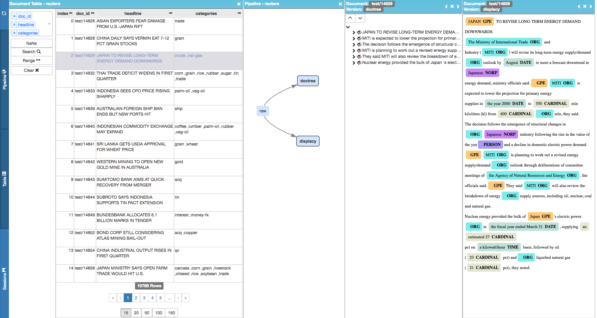

## Pynorama
Pynorama is a tool for visualizing intricate datasets for which a simple table format is not suitable. It was created with Natural Language Processing applications in mind.



Pynorama lets you define *views* in **python** that are rendered as interactive web applications, letting you browse, analyse and understand your data.

Pynorama is **open and extensible.**
Pynorama has a clean and simple architecture.
It makes little assumptions about your data source or data format.
Read in the [documentation](https://pynorama.readthedocs.io) about developing extensions.

## Quickstart

### Install Pynorama

For a minimal install run:  
```
pip install pynorama
```

### Using Pynorama

To create a *view*:
 * define a table describing your data records, currently supported sources are pandas dataframe and mongo queries.
 * define different stages of your data pipeline.
 * return a particular records for a given stage.
 * configure the UI

In python this would look similar to this:
```python
from pynorama import View
from pynorama.table import PandasTable

class ExampleView(View):
    def __init__(self, name, description=''):
        super(ExampleView, self).__init__(name, description)
        setup_data()

    def get_pipeline(self):
        return {
            'raw_stage': {'viewer': 'raw'},
            'tokenized': {'viewer': 'json', 'parents': ['raw_stage']}
        }

    def get_record(self, key, stage):
        if stage == 'raw_stage':
            return get_html(key)
        else:
            return get_processed_data(key)

    def get_table(self):
        return PandasTable(get_dataframe())
```

Next, register the view with pynorama:
```python
from pynorama import register_view

register_view(ExampleView('example'))
```

Finally, let Pynorama set up a *flask* server for you and start it:
```python
from pynorama import make_server

app = make_server()
app.run(host='localhost', port='5000')
```

Now just run your python script! The view should be accessible at *http://localhost:5000/view/example*.

For more information check the [examples](examples) and the [documentation](https://pynorama.readthedocs.io)!

## Acknowledgements

Pynorama was developed at [Man AHL](http://www.ahl.com/).

Original concept and implementation: [Alexander Wettig](https://github.com/CodeCreator)

Contributors from AHL Tech team:

 * [Slavi Marinov](https://github.com/slavi)
 * [Nikolai Matiushev](https://github.com/egao1980)

Contributions welcome!

## License

Pynorama is licensed under the GNU LGPL v2.1.  A copy of which is included in [LICENSE](LICENSE)
